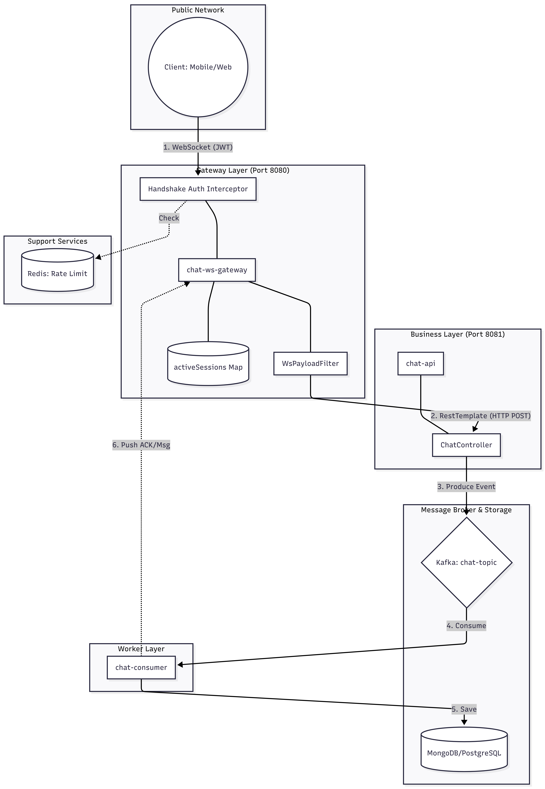

# MESSAGE-APP 🚀 

## 🛠 Tech Stack
*   **Language:** Java
*   **Framework:** Spring Boot
*   **Cache:** Redis
*   **Transport Protocol :** WebSocket
*   **Database:** MongoDB / PostgreSQL
*   **Message Broker:** Apache Kafka
*   **Build Tool:** Maven

## 🏗 Architecture

## 🔄 Data Flow

### 📡 Phase 1: Kết nối (Handshake)
* **Client** yêu cầu kết nối **WebSocket**.
* **Hệ thống** thực hiện các bước kiểm tra:
    * Kiểm tra `Rate Limit` qua **Redis** để phòng chống spam.
    * Xác thực người dùng bằng **JWT**.
    * Nếu hợp lệ, lưu thông tin phiên làm việc vào danh sách `activeSessions`.
* **Response:** Trả về `ACK CONNECTED`.

### ✉️ Phase 2: Gửi tin nhắn (Publishing)
1. **Client** gửi tin nhắn định dạng `JSON`.
2. `WsPayloadFilter`: Thực hiện validate và làm sạch dữ liệu (**Sanitize**).
3. `ChatWebSocketHandler`: Chuyển tiếp (Forward) yêu cầu HTTP sang **Chat-API**.
4. **Chat-API Processing:**
    * **Headers:** Kiểm tra xác thực qua `X-User-Id` và `X-Internal-Request` (Bảo mật nội bộ).
    * **Request Body:** Tiếp nhận các trường `senderName`, `receiverId`, `content`, `clientMessageId`, `type` rồi validate.
    * **Broker:** Sử dụng `kafkaTemplate` tạo ChatMessageEvent để đẩy tin nhắn vào topic `chat-topic`.
5. **Response:** `Chat-API` trả về mã **202 Accepted** cho Gateway để xác nhận đã nhận tin thành công.
6. **Notification:** `ChatWebSocketHandler` gửi phản hồi `ACK SENT` về cho Client.

### 📥 Phase 3: Xử lý tin nhắn (Consumer)
* **Kafka** chuyển giao tin nhắn từ `chat-topic` đến **Chat-Consumer**.
* `ChatService`: Tiếp nhận và xử lý tin nhắn từ Consumer.
* ⚠️ **Trạng thái hiện tại:** Hệ thống đang thực hiện **Logging** để theo dõi luồng.
* 🚧 **Dự kiến hoàn thiện (Todo):**
    * [ ] **Persistence:** Lưu trữ tin nhắn vào Database (**MongoDB / PostgreSQL**).
    * [ ] **Real-time Delivery:** Thực hiện cơ chế **Push** tin nhắn ngược lại cho người nhận (**Receiver**) qua WebSocket.

---

